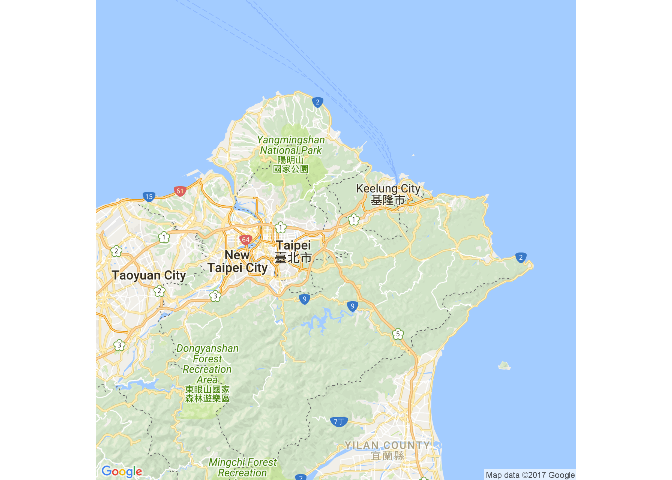
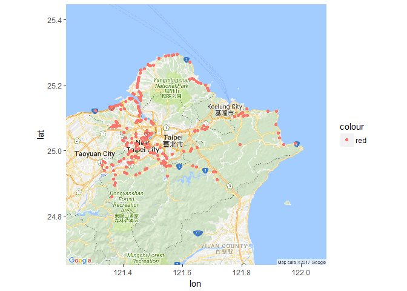
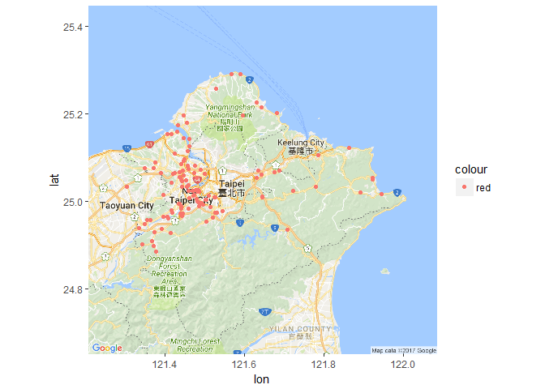
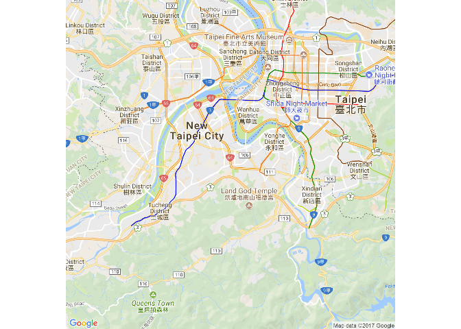
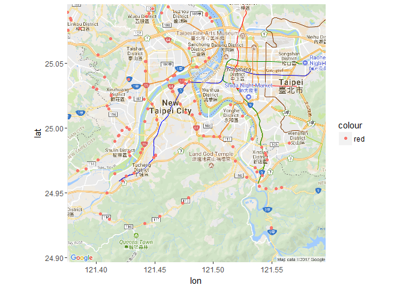
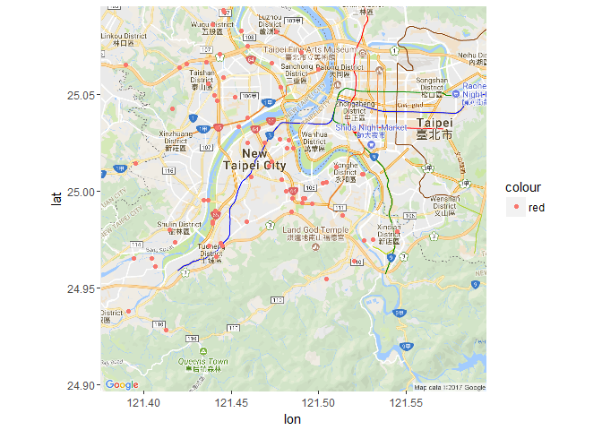

車禍與測速照相機之關聯
================

題目:車禍與測速照相機之關係 資料介紹與來源:測速執法設置點、A1類交通事故資料 政府資料開放平台 格式:csv 分析議題:車禍的發生太過於平凡，新聞上太多因車禍而發生的悲劇，所以我想藉此了解車禍和測速照相的關係 假設:測速照相機的位置比較不會發生車禍 分析結果:否定，有測速照相機的位置並沒有減少車禍的發生 分析結果可能解決的問題:可以藉由此分析結果加強容易車禍地點的臨檢，確實的減少車禍的發生

``` r
library(readr)
```

    ## Warning: package 'readr' was built under R version 3.3.3

``` r
accidentP <- read_csv("C:/Users/Blackcross/Downloads/accidentP.csv")
```

    ## Parsed with column specification:
    ## cols(
    ##   date = col_character(),
    ##   district = col_character(),
    ##   location = col_character(),
    ##   field1 = col_character(),
    ##   field2 = col_character(),
    ##   field3 = col_character(),
    ##   longitude = col_double(),
    ##   latitude = col_double()
    ## )

``` r
library(readr)
photoP <- read_csv("C:/Users/Blackcross/Downloads/photoP.csv" )
```

    ## Parsed with column specification:
    ## cols(
    ##   district = col_character(),
    ##   location = col_character(),
    ##   longitude = col_double(),
    ##   latitude = col_double()
    ## )

``` r
library(dplyr)
```

    ## Warning: package 'dplyr' was built under R version 3.3.3

    ## 
    ## Attaching package: 'dplyr'

    ## The following objects are masked from 'package:stats':
    ## 
    ##     filter, lag

    ## The following objects are masked from 'package:base':
    ## 
    ##     intersect, setdiff, setequal, union

``` r
accident<-group_by(accidentP,district)
summarise(accident,nlocation=n())%>%
arrange(desc(nlocation))
```

    ## # A tibble: 27 × 2
    ##    district nlocation
    ##       <chr>     <int>
    ## 1    中和區        11
    ## 2    板橋區        10
    ## 3    土城區         8
    ## 4    五股區         8
    ## 5    三峽區         7
    ## 6    汐止區         6
    ## 7    泰山區         6
    ## 8    新莊區         6
    ## 9    樹林區         6
    ## 10   八里區         5
    ## # ... with 17 more rows

``` r
photo<-group_by(photoP,district)
summarise(photo,nlocation=n())%>%
arrange(desc(nlocation))
```

    ## # A tibble: 27 × 2
    ##    district nlocation
    ##       <chr>     <int>
    ## 1    八里區        20
    ## 2    新店區        19
    ## 3    淡水區        18
    ## 4    林口區        16
    ## 5    板橋區        15
    ## 6    土城區        13
    ## 7    三峽區        12
    ## 8    新莊區        12
    ## 9    瑞芳區        12
    ## 10   三重區        11
    ## # ... with 17 more rows

``` r
library(ggmap)
```

    ## Warning: package 'ggmap' was built under R version 3.3.3

    ## Loading required package: ggplot2

    ## Warning: package 'ggplot2' was built under R version 3.3.3

``` r
photoP$longitude<-as.numeric(photoP$longitude)
photoP$latitude<-as.numeric(photoP$latitude)

NewTaipeiMap <- get_map(
    location = c(121.30,24.80,121.99,25.30), 
    zoom = 10, maptype = 'roadmap')
```

    ## Warning: bounding box given to google - spatial extent only approximate.

    ## converting bounding box to center/zoom specification. (experimental)

    ## Map from URL : http://maps.googleapis.com/maps/api/staticmap?center=25.05,121.645&zoom=10&size=640x640&scale=2&maptype=roadmap&language=en-EN&sensor=false

``` r
NewTaipeiMap0 <- ggmap(NewTaipeiMap)+ 
    geom_point(data=photoP, 
               aes(x=longitude, y=latitude,
                   color="red"))
ggmap(NewTaipeiMap,extent = 'device')
```

    ## Warning: `panel.margin` is deprecated. Please use `panel.spacing` property
    ## instead



``` r
NewTaipeiMap0
```



``` r
library(ggmap)
accidentP$longitude<-as.numeric(accidentP$longitude)
accidentP$latitude<-as.numeric(accidentP$latitude)

NewTaipeiMap <- get_map(
    location = c(121.30,24.80,121.99,25.30), 
    zoom = 10, maptype = 'roadmap')
```

    ## Warning: bounding box given to google - spatial extent only approximate.

    ## converting bounding box to center/zoom specification. (experimental)

    ## Map from URL : http://maps.googleapis.com/maps/api/staticmap?center=25.05,121.645&zoom=10&size=640x640&scale=2&maptype=roadmap&language=en-EN&sensor=false

``` r
NewTaipeiMap1 <- ggmap(NewTaipeiMap)+ 
    geom_point(data=accidentP, 
               aes(x=longitude, y=latitude,
                   color="red"))
ggmap(NewTaipeiMap,extent = 'device')
```

    ## Warning: `panel.margin` is deprecated. Please use `panel.spacing` property
    ## instead


``` r
NewTaipeiMap1
```



``` r
library(ggmap)
ZhongheMap <- get_map(
    location = "Zhonghe", 
    zoom = 12, maptype = 'roadmap')
```

    ## Map from URL : http://maps.googleapis.com/maps/api/staticmap?center=Zhonghe&zoom=12&size=640x640&scale=2&maptype=roadmap&language=en-EN&sensor=false

    ## Information from URL : http://maps.googleapis.com/maps/api/geocode/json?address=Zhonghe&sensor=false

``` r
ZhongheMap0 <- ggmap(ZhongheMap)+ 
    geom_point(data=photoP, 
               aes(x=longitude, y=latitude,
                   color="red"))
ggmap(ZhongheMap,extent = 'device')
```

    ## Warning: `panel.margin` is deprecated. Please use `panel.spacing` property
    ## instead



``` r
ZhongheMap0
```

    ## Warning: Removed 123 rows containing missing values (geom_point).



``` r
library(ggmap)
ZhongheMap <- get_map(
    location = "Zhonghe", 
    zoom = 12, maptype = 'roadmap')
```

    ## Map from URL : http://maps.googleapis.com/maps/api/staticmap?center=Zhonghe&zoom=12&size=640x640&scale=2&maptype=roadmap&language=en-EN&sensor=false

    ## Information from URL : http://maps.googleapis.com/maps/api/geocode/json?address=Zhonghe&sensor=false

``` r
ZhongheMap1 <- ggmap(ZhongheMap)+ 
    geom_point(data=accidentP, 
               aes(x=longitude, y=latitude,
                   color="red"))
ggmap(ZhongheMap,extent = 'device')
```

    ## Warning: `panel.margin` is deprecated. Please use `panel.spacing` property
    ## instead


``` r
ZhongheMap1
```

    ## Warning: Removed 50 rows containing missing values (geom_point).


